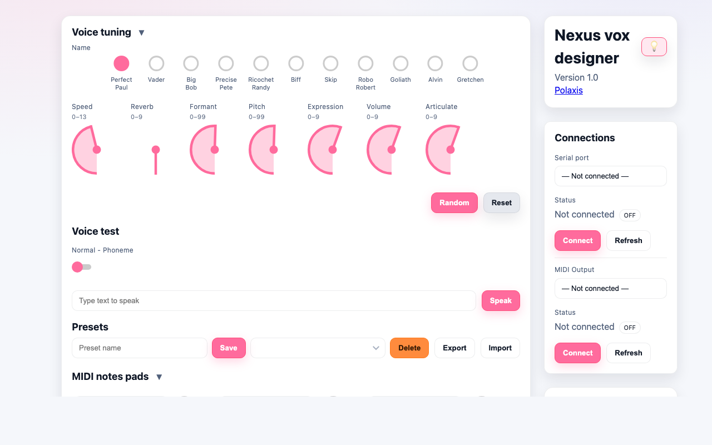

# Nexus Vox Designer

Nexus Vox Designer is a single-page browser tool for controlling a Kraftor/Polaxis voice device over Web Serial, with optional Web MIDI output pads. The app lives entirely in `index.html` and uses NexusUI widgets for the dials, buttons, radio selector, and toggle.

Live page: https://deladriere.github.io/Nexus_Designer/



## Files

- `index.html` - the complete app: layout, styles, NexusUI controls, Web Serial logic, Web MIDI logic, presets, and UI helpers.
- `nexus_vox_designer.png` - screenshot/reference image used by this README.

## Requirements

- A Chromium-based browser such as Chrome or Edge.
- Web Serial support for the hardware connection.
- Web MIDI support if you want to use the MIDI note pads.
- Internet access when loading the page, because NexusUI is loaded from:

```html
https://cdn.jsdelivr.net/npm/nexusui@latest/dist/NexusUI.js
```

## Running It

Open `index.html` in Chrome or Edge.

The app is static, so there is no build step, package install, or local server required. If browser permissions behave differently on your machine, serving the folder from a local web server also works.

## Basic Workflow

1. Open `index.html`.
2. Connect the voice hardware by clicking `Connect` in the `Serial port` section.
3. Grant the browser permission to access the serial device.
4. Adjust the voice controls. Each voice/dial change sends a serial command to the device.
5. Type text in `Voice test` and click `Speak`, or press Enter, to send the text to the device.
6. Optionally choose a MIDI output, connect it, and press the MIDI pads to send notes 36-47.

## Serial Connection

The serial connection uses the browser Web Serial API:

- Baud rate: `115200`
- Line ending: every outgoing serial message is sent with `\r\n`
- Incoming serial text is shown in the `Serial Monitoring` panel.

After connecting, the app automatically sends `/f` to request firmware information. If the device replies, the firmware row is shown in the connection panel.

## Voice Controls

The voice selector sends a voice command:

| Control | Range | Serial command |
| --- | ---: | --- |
| Voice | 0-10 | `/vN` |
| Speed | 0-13 | `/sN` |
| Reverb | 0-9 | `/rN` |
| Formant | 0-99 | `/tN` |
| Pitch | 0-99 | `/pN` |
| Expression | 0-9 | `/eN` |
| Volume | 0-9 | `/uN` |
| Articulate | 0-9 | `/qN` |

Dial changes are debounced by 250 ms so the device is not flooded while a dial is being moved.

The available voices are:

| Index | Voice |
| ---: | --- |
| 0 | Perfect Paul |
| 1 | Vader |
| 2 | Big Bob |
| 3 | Precise Pete |
| 4 | Ricochet Randy |
| 5 | Biff |
| 6 | Skip |
| 7 | Robo Robert |
| 8 | Goliath |
| 9 | Alvin |
| 10 | Gretchen |

## Voice Test

The `Normal - Phoneme` toggle changes speech mode:

| Mode | Serial command |
| --- | --- |
| Normal | `/n` |
| Phoneme | `/d` |

The `Speak` button sends the text field contents directly over serial. Pressing Enter inside the text field does the same thing.

## Random And Reset

`Random` chooses a random voice and random values for all dials, then sends the commands to the device. The voice command is sent first, followed by the parameter commands.

`Reset` sends `/o` to the device and restores the UI defaults:

| Control | Default |
| --- | ---: |
| Voice | 0 |
| Speed | 6 |
| Reverb | 0 |
| Formant | 50 |
| Pitch | 50 |
| Expression | 5 |
| Volume | 5 |
| Articulate | 5 |

Keyboard shortcut: press `r` outside text inputs to trigger `Random`.

## Presets

Presets are saved in browser `localStorage` under:

```text
nexus.presets.v1
```

A preset stores the current voice and dial values as a compact command string, for example:

```text
0v 6s 0r 50t 50p 5e 5u 5q
```

Presets are for voice/settings configurations only. They do not store the words entered in the MIDI pad text fields.

When a preset is selected, the app updates the UI and sends the stored commands to the serial device. Voice is sent first, then the dial commands.

Preset buttons:

- `Save` creates or updates a preset.
- `Delete` removes the selected preset.
- `Export` downloads all presets as `nexus-presets.json`.
- `Import` merges presets from a JSON file.

## MIDI Pads

The MIDI section uses the browser Web MIDI API.

1. Select a MIDI output.
2. Click `Connect`.
3. Press a pad to send a short note.

Pads send MIDI notes `36` through `47` on channel 1. Each pad sends Note On, then Note Off after about 120 ms.

The text fields beside the pads are separate from presets. They can be sent to the serial device with `Update`. The app concatenates non-empty fields with `@` separators and sends one serial payload:

```text
@first text@second text@third text
```

## Phonetic Mode Reference

The app includes a collapsed `Phonetic mode reference` table under `Voice test`. It lists the Nexus phoneme symbols and examples.

The table is based on the Polaxis Nexus phonetics information published on the [Phonetics download page](https://www.polaxis.be/download/phonetics/).

## Tooltips

The lightbulb button toggles tooltips on and off. The setting is saved in browser `localStorage` under:

```text
nexus.tooltips.enabled
```

## Troubleshooting

- If `Connect` does nothing, use Chrome or Edge and make sure the device is plugged in.
- If the serial device does not appear, click `Refresh`, reconnect the USB cable, or reload the page.
- If dials and buttons do not render, check that the NexusUI CDN script is reachable.
- If MIDI outputs do not appear, make sure the browser has Web MIDI support and the MIDI device or virtual port is available before clicking `Refresh`.
- Presets are browser-local. Export them if you need to move them to another browser or machine.
